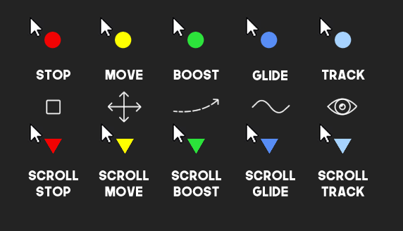
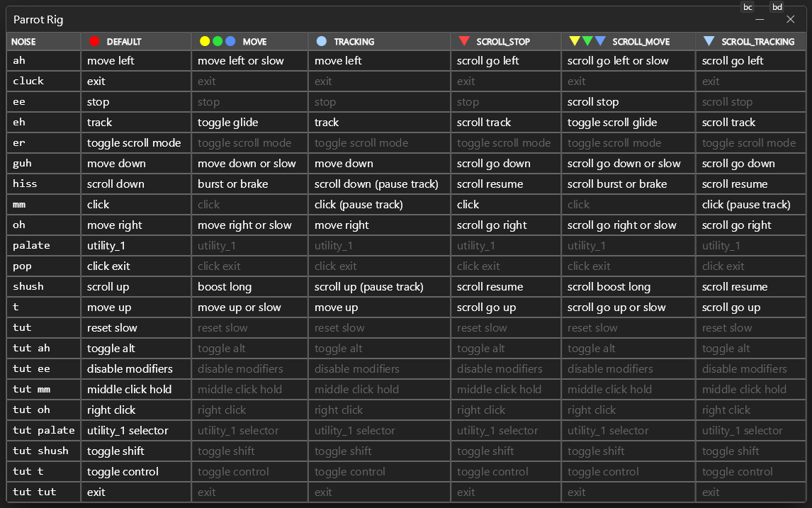

# Parrot Rig


A general-purpose 14-noise parrot mode for hands-free mouse control in [Talon](https://talonvoice.com/). This is my daily driver for general mouse use.

You'll need at least 9 noises to use this, 14 recommended for the full experience. See remapping instructions below to make it your own.




## Installation

### Dependencies

- [**Talon Beta**](https://talon.wiki/Help/beta_talon/)
- **Eye Tracker** - Eye tracking device (e.g., Tobii 4C or Tobii 5)
- **Parrot** - Trained parrot model with `parrot_integration.py` and `patterns.json` files
- [**talon-input-map**](https://github.com/rokubop/talon-input-map/) (v1.0.1+)
- [**talon-mouse-rig**](https://github.com/rokubop/talon-mouse-rig) (v4.1.1+)
- [**talon-ui-elements**](https://github.com/rokubop/talon-ui-elements) (v0.16.0+)
- [**talon-rig-core**](https://github.com/rokubop/talon-rig-core) (v0.6.5+) - required by talon-mouse-rig

### Install

Clone the dependencies and this repo into your [Talon](https://talonvoice.com/) user directory:

```sh
# Mac/Linux
cd ~/.talon/user

# Windows
cd ~/AppData/Roaming/talon/user

# Dependencies
git clone https://github.com/rokubop/talon-input-map/
git clone https://github.com/rokubop/talon-mouse-rig
git clone https://github.com/rokubop/talon-ui-elements
git clone https://github.com/rokubop/talon-rig-core

# This repo
git clone https://github.com/rokubop/talon-parrot-rig
```

## How to customize

This repo ships with my personal noise assignments. Your trained noises will be different. The goal is to **replace each noise with your own equivalent**. The actions and mode structure stay the same; you're just swapping which noise triggers what.

### Noise reference

Use this table to understand what role each noise plays, then decide which of your noises best fits each slot. Listed in priority order, starting from the top.

| Noise | Role | What it does |
|-------|------|-------------|
| `ah` | direction | Move left |
| `oh` | direction | Move right |
| `t` | direction | Move up |
| `guh` | direction | Move down |
| `ee` | stop | Stop all movement and scrolling |
| `pop` | click | Click and exit mode |
| `mm` | click | Click (stay in mode) |
| `hiss` | scroll / boost | Scroll down, boost in move mode |
| `shush` | scroll / boost | Scroll up, boost in move mode |
| `eh` | tracking / glide | Activate tracking, toggle glide in move mode |
| `er` | scroll mode | Toggle scroll mode |
| `cluck` | exit | Exit parrot rig |
| `palate` | utility_1 | Execute utility action |
| `tut` | combo prefix / reset | Reset speed, prefix for combos (e.g. `tut oh` = right click) |

Recommend **at least 9 noises**: 4 directions + stop + click + exit + 2 scrolls.

Say **"parrot help"** to see the full input map reference in-app:



### Remapping steps

You'll edit 3 files. In each file, replace every occurrence of the old noise name with your noise name.

**1. [parrot_rig_actions.py](./parrot_rig_actions.py)** - Find-and-replace noise names in the input maps. For example, to use `alveolar_click` instead of `pop` for "click exit":

```python
# before
"pop":    ("click exit", actions.user.parrot_rig_click_exit),
# after
"alveolar_click":  ("click exit", actions.user.parrot_rig_click_exit),
```

Replace all instances of that noise throughout the file (it appears in multiple mode maps).

If you don't have enough noises, you can use combos to free up single noises for more actions. For example, `"tut ah"`, `"tut oh"`, `"tut mm"` as combos instead of using those noises alone.

**Mac users:** Change `"ctrl"` to `"cmd"` in the modifier toggle for `tut t` in `input_map_common`.

**2. [parrot_rig_input.talon](./parrot_rig_input.talon)** - Match the `parrot(...)` trigger on the left to your noise. The string on the right must match the key you used in step 1:

```talon
parrot(alveolar_click): user.input_map_channel_handle("parrot_rig", "alveolar_click")
```

**3. [parrot.talon](./parrot.talon)** - Noises outside parrot rig mode. Only use noises here that won't interfere with your voice commands. You need at least one noise or voice command to call `user.parrot_rig_enable()` as your entry point:

```talon
parrot(cluck): user.parrot_rig_enable()

# or use a voice command instead
parrot rig start: user.parrot_rig_enable()
```

See [talon-input-map](https://github.com/rokubop/talon-input-map/) for the full set of options to fine-tune how each noise behaves:
- **combos** (`"tut ah"`) - trigger an action with a sequence of noises
- **throttle** (`:th_100`) - limit how often a noise fires (e.g. make a continuous noise act like a discrete trigger)
- **debounce** (`:db_170`) - delay firing so brief interruptions don't trigger it (used on `_stop` events like `hiss_stop`, `shush_stop`)
- **hold/release**, **repeat**, and more

> **Important:** After any changes to this repo, say **"parrot reload"** (or **"parrot reset"**). Talon often won't pick up mapping changes automatically due to how the repo is structured.

### Optional: [parrot_rig_settings.py](./parrot_rig_settings.py)

Speeds, timings, colors, and click behavior. Say **"parrot rig reload"** after changing these.

```python
MOVE_SPEED = 3
SLOW_MODE_MULTIPLIER = 0.5
BOOST_AMOUNT = 10
SCROLL_SPEED = 0.4
TRACKING_STOP_MS = 800
CLICK_HOLD_MS = 16000
```

### Optional: Utilities

Utilities let you bind extra actions to a single noise. Each utility slot holds one active action at a time. By default, `utility_1` is assigned to `palate`.

To assign a utility to a noise, add two entries in `parrot_rig_actions.py` in `input_map_common`:

```python
"palate":     ("utility_1", lambda: actions.user.parrot_rig_utility("utility_1")),              # fires the active action
"tut palate": ("utility_1 selector", lambda: actions.user.parrot_rig_show_utility_selector("utility_1", "palate")),  # opens the picker
```

To use it, just make the noise - it fires the currently selected action. To change which action is selected, use the selector combo to open a picker, then make one of the selector noises to choose an option. The first key in each map is the default on startup.

To add more utility slots, add a new entry to `utility_maps` and wire it to a noise the same way.

Add, remove, or reorder options:

```python
utility_maps = {
    "utility_1": {
        "hold_click":  ("Hold Click",  lambda: actions.user.parrot_rig_click(0, True)),
        "click":       ("Click",       lambda: actions.user.parrot_rig_click(0)),
        "right_click": ("Right Click", lambda: actions.user.parrot_rig_click(1)),
        ...
    },
}
```

## More Talon packages
Check out my other Talon packages for UI, mouse control, input mapping, and more at [talon-hub-roku](https://github.com/rokubop/talon-hub-roku).
